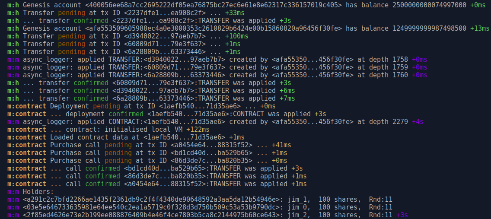

# Share Registry Contract

A Wavelet smart contract that implements share purchase and issuance as
a simple association of addresses to balances and names.

Implemented to begin learning development of Wavelet contracts using Rust.

__Constraints__
 * _Minimum parcel size_: Purchaser must request a minimum amount of shares to
   participate in the sale
 * _Dummy KYC_:	Check all potential holders (sale or transfer) against a KYC
   service - a function that returns true.
 * _Cool-off Period_: Investors can cancel their purchase within a fixed number
   of rounds following the purchase.

## Node Client
Basic nodejs client demonstrating synchronous transaction submission and
confirmation in a structure that will be familiar to trufflejs users.

This client is an initial sketch for implementing a truffle-like framework
for Wavelet in order to lower on-boarding friction for Web3 dApp developers.

### Setup

*Before you start*
1. You must be running a local Wavelet testnet. Follow [Perlin's
guide](https://wavelet.perlin.net/docs/setup) to get up and running.

2. You must also have the rust dependencies specified in the [Smart
Contract](https://wavelet.perlin.net/docs/smart-contracts#setup) setup.

*Ready to roll...*

Clone this repository then run the following in your terminal:
```bash
cd <path>/share-registry-contract

build cargo build --release --target wasm32-unknown-unknown                       

cd client

npm run start
```



## Issues
 - [ ] Supply should be checked as invariant
 - [ ] Should only be allowed one investment inside cool-off
 - [ ] Safe balance updates using `HashMap.get()` and `.insert()`, instead of `.or_insert()`
 - [ ] Cancelling investment reverses all parcels purchased
 - [ ] Cool-off period set at spawn
 - [ ] Price increases in tranches as round\_idx increases and remaining supply decreases

